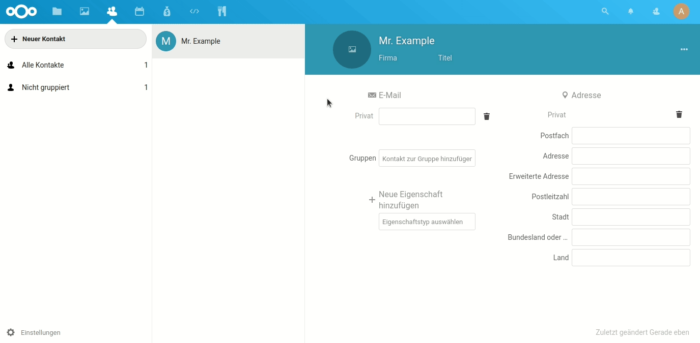

# Fork of Nextcloud Contacts

This is a fork of [Nextcloud Contacts](https://github.com/nextcloud/contacts/) in order to sync profile pictures from social networks.



**Is your feature request related to a problem? Please describe.**
Most of my contacts don't have profile pictures in nextcloud, as this is quite some work to set up and maintain. Nevertheless, I would love to have more color in my address book. Others seem to have the same desire, as can be seen by the reactions when google and facebook removed the integration in android: https://www.facebook.com/help/community/question/?id=10153485306296293

**Describe the solution you'd like**
I would love to integrate with facebook the way the app [ContactSyncDuck](https://play.google.com/store/apps/details?id=com.lifeternet.profilephotosync) does: when users add a dedicated field (for example `X-SOCIALPROFILE;TYPE=facebook:<profile_id>`, the picture can be downloaded: `http://graph.facebook.com/<profile_id>/picture?type=large`. This works without facebook credentials, token, or login.
Example: Frank Karlitschek has the Facebook ID 1004752406 (which the user adds to the respective contact) - so the contact app can automatically include the picture from http://graph.facebook.com/1004752406/picture?type=large
Re-sync could be triggered manually (per contact or address book) or added as a cron-job.

**Describe alternatives you've considered**
A more convenient way would be to include a facebook authorization form to link and download the pictures without manual insertion of the profile_ids. But I believe that this integration does not match the expectations of nextcloud users.

**Additional context**
Of course, other netwoks, like Gravatar, are also an option (as proposed by @brettferrell : https://github.com/nextcloud/contacts/issues/33#issuecomment-458630428)

## Setup

Set up a docker-compose for nextcloud and a volume that maps the github-project into /var/www/html/custom_apps/contacts:
<details>
  <summary>docker-compose.yml</summary>
   <p>

```yml
version: '2'

volumes:
 nextcloud:

services:
  app:
    image: nextcloud
    ports:
      - 8099:80
    volumes:
      - nextcloud:/var/www/html
      - ./contacts:/var/www/html/custom_apps/contacts
    restart: unless-stopped
```
</p>
</details>

In that folder run `make dev-setup` to install and then `make watch-js` to watch and compile your changes.

Fire-up your Nextcloud instance by running `docker-compose up -d` in the directory where the above described docker-compose.yml is stored. Access the app at http://localhost:8099/apps/contacts/ and reload the page with `CTRL`+`F5`.
